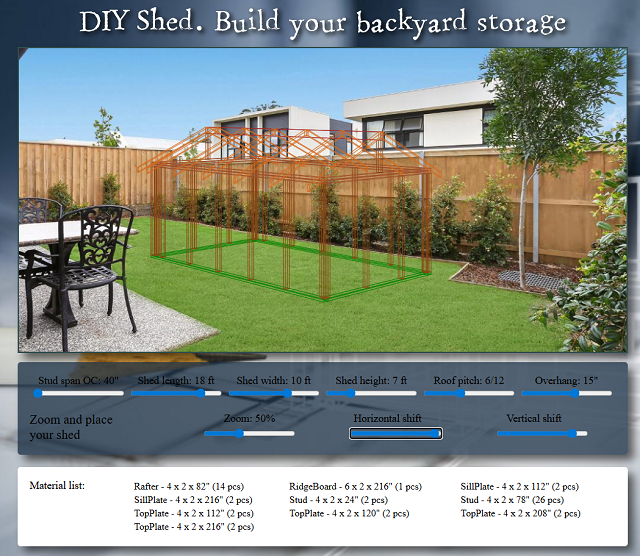

# Parametric Garden Shed Planner

Interactive web tool for configuring a simple wooden garden shed.

Live demo:  
https://martinschwarz73.github.io/svgTraining_Shed/

## Features

adjustable shed width and length
configurable stud spacing
dynamic SVG rendering of walls and roof
positioning of shed on background garden image
automatic material list calculation

## Tech

HTML, CSS, JavaScript, SVG
